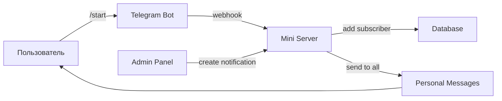

# 🚀 РУКОВОДСТВО ПО РАЗВЕРТЫВАНИЮ TELEGRAM СЕРВЕРА

## 📋 Что готово:

✅ **Node.js сервер** - `telegram-bot-server.js`
✅ **Админ панель обновлена** - работает с новым сервером  
✅ **Система личных сообщений** - никаких каналов!
✅ **Автосбор подписчиков** - через webhook

## 🎯 КАК ЗАПУСТИТЬ СЕРВЕР:

### 1️⃣ ЛОКАЛЬНО (для разработки):

```bash
# Установить зависимости
npm install express cors node-fetch

# Запустить сервер
node telegram-bot-server.js
```

Сервер будет доступен на `http://localhost:3001`

### 2️⃣ PRODUCTION (бесплатно):

#### Вариант A: Vercel
```bash
# 1. Создайте файл vercel.json:
{
  "version": 2,
  "builds": [{ "src": "telegram-bot-server.js", "use": "@vercel/node" }],
  "routes": [{ "src": "/(.*)", "dest": "/telegram-bot-server.js" }]
}

# 2. Деплой:
npx vercel --prod
```

#### Вариант B: Railway
1. Подключите GitHub репозиторий
2. Railway автоматически развернет сервер
3. Получите URL: `https://your-app.railway.app`

#### Вариант C: Heroku
```bash
# 1. Создайте Procfile:
web: node telegram-bot-server.js

# 2. Деплой:
git push heroku main
```

## 🔧 НАСТРОЙКА АДМИН ПАНЕЛИ:

1. **Обновите URL сервера** в `src/services/telegramServerService.ts`:
```typescript
this.serverUrl = 'https://your-server-url.com';  // Замените на реальный URL
```

2. **Настройте бота** в админ панели:
   - Получите токен от @BotFather
   - Введите в модальном окне настройки
   - Сервер автоматически настроит webhook

## 🔄 КАК ЭТО РАБОТАЕТ:



## 📤 ОТПРАВКА УВЕДОМЛЕНИЙ:

1. Откройте админ панель
2. Перейдите во вкладку "Уведомления"  
3. Нажмите "Новое уведомление"
4. Введите заголовок и текст
5. Нажмите "Отправить"

**Результат**: Все подписчики получат ЛИЧНОЕ сообщение в чат с ботом!

## 🛠️ API ENDPOINTS:

- `POST /api/bot/config` - Настройка бота
- `POST /api/notifications/send` - Отправка уведомлений  
- `GET /api/subscribers` - Статистика подписчиков
- `GET /health` - Проверка здоровья сервера
- `POST /webhook` - Webhook для Telegram

## 🔒 БЕЗОПАСНОСТЬ:

- Токен бота хранится только на сервере
- CORS настроен для вашего домена
- Webhook защищен от спама
- Автоочистка заблокировавших пользователей

## 🎉 ГОТОВО К ИСПОЛЬЗОВАНИЮ!

После развертывания сервера у вас будет:
- ✅ Полноценная система личных уведомлений
- ✅ Автоматический сбор подписчиков  
- ✅ Красивая админ панель для управления
- ✅ Статистика доставки сообщений
- ✅ Обход всех CORS ограничений

**Никаких каналов - только личные сообщения каждому пользователю!** 🎯